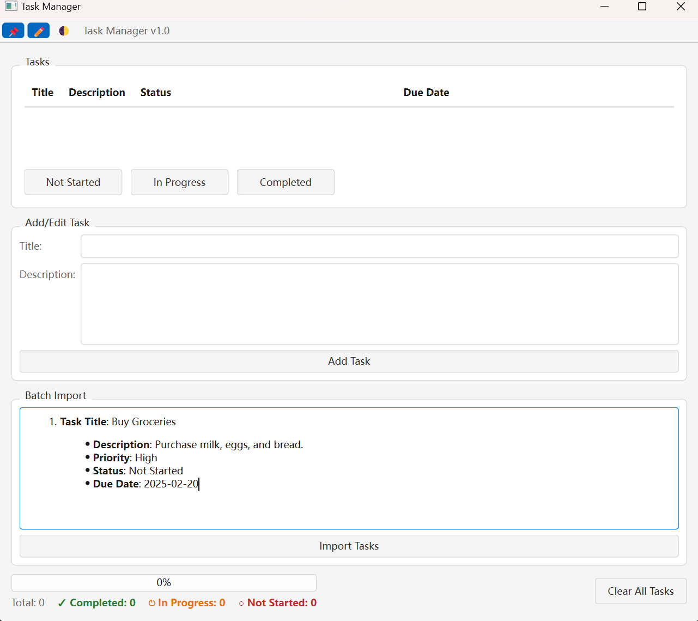
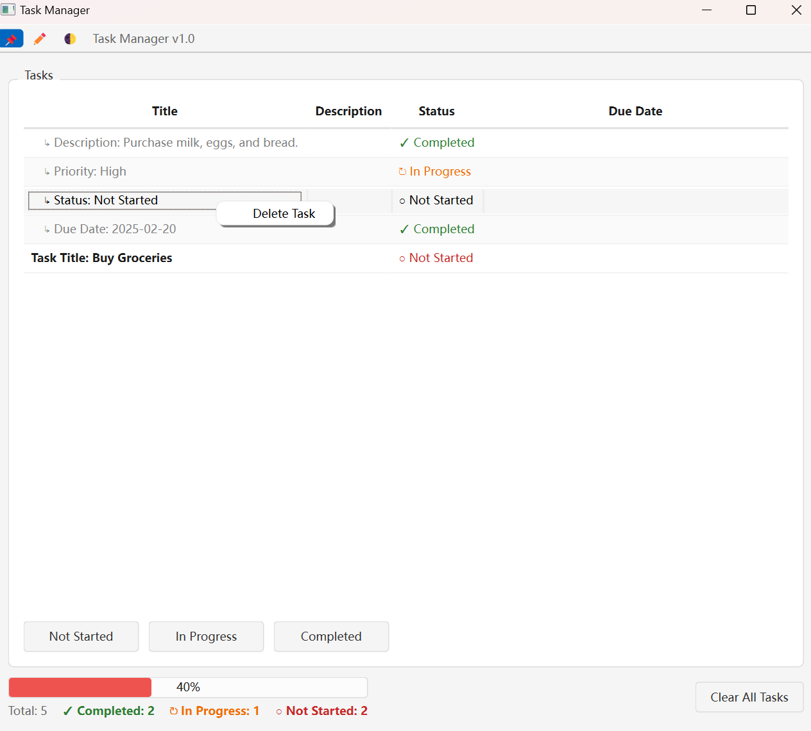

# TodoManager

A modern, hierarchical task management application built with PyQt6.


## Features

### Task Management
- Add individual tasks
- Batch import tasks
- Delete multiple tasks
- Update task status
- Parent-child relationships

### Progress Tracking
- Visual progress bar with color coding
- Task status breakdown:
  - Completed (Green)
  - In Progress (Orange)
  - Not Started (Red)

### User Interface
- Light/Dark theme support
- Modern, clean interface
- Smooth transitions
- Right-click context menu

### Data Management
- SQLite database backend
- Efficient batch operations
- Cascade deletion for subtasks
- Data integrity protection

## Recent Updates
- Immediate task deletion without confirmation
- Enhanced progress visualization
- Temporary success messages
- Comprehensive logging system

## Installation

1. Clone the repository:
```bash
git clone https://github.com/yourusername/TodoManager.git
cd TodoManager
```

2. Create a virtual environment (optional but recommended):
```bash
python -m venv venv
source venv/bin/activate  # Linux/Mac
# or
venv\Scripts\activate     # Windows
```

3. Install dependencies:
```bash
pip install -r requirements.txt
```

4. Initialize the database:
```bash
python src/db/database.py
```

5. Run the application:
```bash
python src/main.py
```

## Packaging

1. Install PyInstaller:
```bash
pip install pyinstaller
```

2. Create the executable:
```bash
pyinstaller --onefile --windowed --name TodoManager --icon=assets/icon.ico --add-data "src;src" --hidden-import sqlite3 src/main.py
```

## Usage

1. Run the application:
```bash
python src/main.py
```

2. Use the toolbar controls:
   - Pin/unpin window
   - Show/hide task editing
   - Toggle Light/Dark theme

3. Manage tasks:
   - Add individual tasks with title and description
   - Import multiple tasks at once
   - Update task status (Not Started, In Progress, Completed)
   - View task hierarchy and progress

## Development

### Project Structure
```
TodoManager/
├── src/
│   ├── db/
│   │   └── database.py    # Database operations
│   ├── logic/
│   │   └── task_manager.py # Business logic
│   ├── ui/
│   │   ├── main_window_qt.py # UI implementation
│   │   └── themes.py      # Theme management
│   ├── version.py        # Version control
│   └── main.py          # Application entry
├── requirements.txt     # Dependencies
└── README.md           # Documentation
```

### Version Control

We follow [Semantic Versioning](https://semver.org/):
- MAJOR version for incompatible API changes
- MINOR version for new functionality in a backward compatible manner
- PATCH version for backward compatible bug fixes

### Upgrade Strategy

1. **Database Migrations**:
   - Version-specific migration scripts in `db/migrations/`
   - Automatic migration on startup

2. **Feature Updates**:
   - New features added in MINOR versions
   - Bug fixes in PATCH versions
   - Breaking changes reserved for MAJOR versions

3. **UI Updates**:
   - Theme improvements in PATCH versions
   - New UI components in MINOR versions
   - Layout changes in MAJOR versions

## Contributing

1. Fork the repository
2. Create a feature branch
3. Commit your changes
4. Push to the branch
5. Create a Pull Request

## License

This project is licensed under the MIT License - see the LICENSE file for details.
